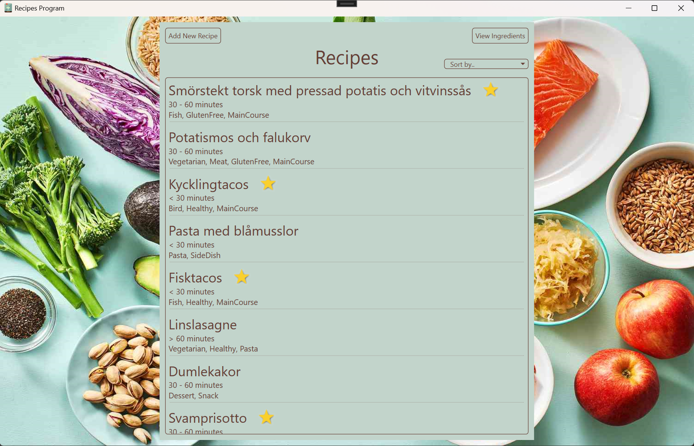
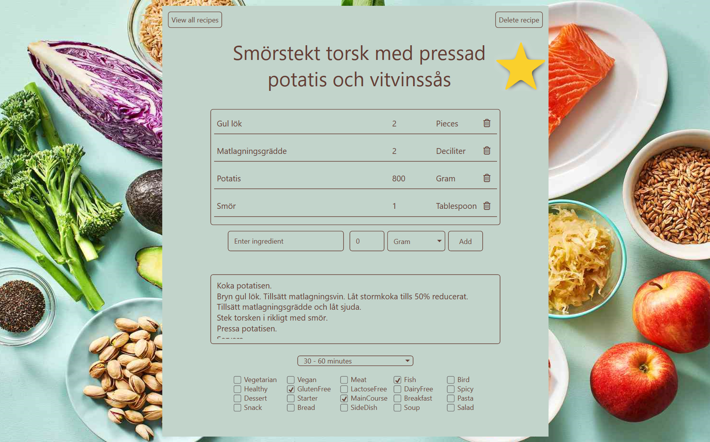
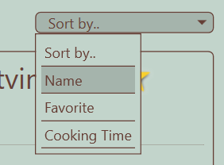
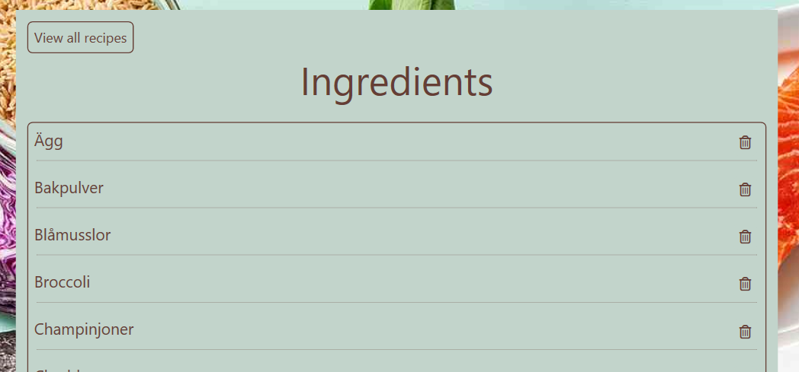
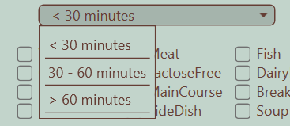
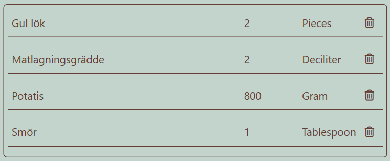
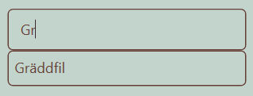
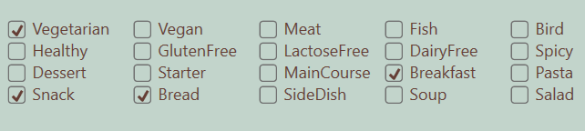

# Recipes

This is a WPF application built with the MVVM design pattern. The project uses a **SQL Server database** and **Entity Framework** for data management.  



## Purpose  

The application serves as a digital recipe book where users can:  
- Add, edit, and delete recipes.


  
- Sort the recipe list by:  
  - Preparation time  
  - Favorite recipes  
  - Recipe name
 


- Manage ingredients stored in the database.  



## Technologies Used  

- **WPF (Windows Presentation Foundation)**  
- **C#**  
- **Entity Framework**  
- **SQL Server**  
- **MVVM Design Pattern**  



## Running the Application  

1. **Clone the Repository**:  
   Clone this repository to your local machine:  
   ```bash  
   git clone https://github.com/modigida/Recipes.git



2. **Set Up the Database**:  
- Add your own connection string to the project.
- Optionally, restore the provided backup file to your SQL Server using Management Studio (SSMS) to use the same database that was used during development.



3. **Run the Application**:  
Open the solution in Visual Studio, build the project, and run the application.

## Features
- A user-friendly interface for managing recipes and ingredients.
- Sorting functionality for recipes to easily find favorites, quickest to prepare, or alphabetical order.
- Fully integrated with SQL Server to store and retrieve recipe and ingredient data.


